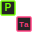

#  The Periodic Table of Elements

An interactive periodic table application built with React and TypeScript. Browse all 118 elements, filter by category or threat level, and view detailed information for each element.

[](https://app.netlify.com/projects/periodic-table-of-chemical-elements/deploys)
[](https://opensource.org/licenses/MIT)

## Features

- **Interactive Element Grid**: Click any element to view detailed information including physical properties, history, and discovery
- **Lanthanoid & Actinoid Series**: Dedicated detail panels for the lanthanoid and actinoid series with mini periodic table visualization
- **Category Filtering**: Filter elements by 10 categories (alkali metals, noble gases, transition metals, etc.)
- **Threat Level Indicators**: Visual indicators for elements with limited availability, rising threats, or serious supply concerns
- **Synthetic Element Display**: Synthetic elements display atomic mass in [brackets] to indicate no stable isotopes
- **Responsive Design**: Works on desktop, tablet, and mobile devices
- **Accessible**: Keyboard navigation and ARIA attributes for screen readers

## Tech Stack

- **React 19** - UI framework
- **TypeScript 5** - Type-safe JavaScript
- **Vite 7** - Build tool and dev server
- **CSS Modules** - Scoped component styling
- **Vitest** - Unit testing framework
- **React Testing Library** - Component testing

## Getting Started

### Prerequisites

- Node.js 18+
- npm or yarn

### Installation

```bash
npm install
```

### Development

```bash
npm run dev
```

The app will open at `http://localhost:5173` (or the next available port).

### Build

```bash
npm run build
```

Outputs production build to `dist/`

### Testing

```bash
npm test
```

Run tests with coverage:

```bash
npm run coverage
```

## Project Structure

```
src/
├── components/
│   ├── Element/           # ElementCell component
│   ├── ElementDetail/     # Detail panels (ElementDetail, SeriesDetail, Modal styles)
│   ├── PeriodicTable/     # Main table grid
│   ├── CategoryFilter/    # Category filter buttons
│   ├── ThreatFilter/      # Threat level filter
│   ├── Footer/            # Page footer
│   └── common/            # Shared components
├── data/
│   ├── elements.ts        # All 118 elements data
│   ├── categories.ts      # Category definitions
│   ├── series.ts          # Lanthanoid/Actinoid series data
│   └── tableLayout.ts     # Grid positioning
├── hooks/
│   └── usePeriodicTableState.ts  # State management
├── types/
│   └── element.types.ts   # TypeScript interfaces
└── styles/
    ├── variables.css      # CSS custom properties
    └── global.css         # Global styles
```

## Element Categories

| Category               | Count | Examples                   |
| ---------------------- | ----- | -------------------------- |
| Transition Metals      | 38    | Fe, Cu, Au, Ag             |
| Lanthanoids            | 15    | La, Ce, Nd, Eu             |
| Actinoids              | 15    | Ac, U, Pu, Am              |
| Post-Transition Metals | 11    | Al, Sn, Pb, Bi             |
| Metalloids             | 8     | B, Si, Ge, As, Po, Ts      |
| Noble Gases            | 7     | He, Ne, Ar, Kr, Xe, Rn, Og |
| Other Nonmetals        | 7     | H, C, N, O, P, S, Se       |
| Alkali Metals          | 6     | Li, Na, K, Rb, Cs, Fr      |
| Alkaline Earth Metals  | 6     | Be, Mg, Ca, Sr, Ba, Ra     |
| Halogens               | 5     | F, Cl, Br, I, At           |

## License

MIT
